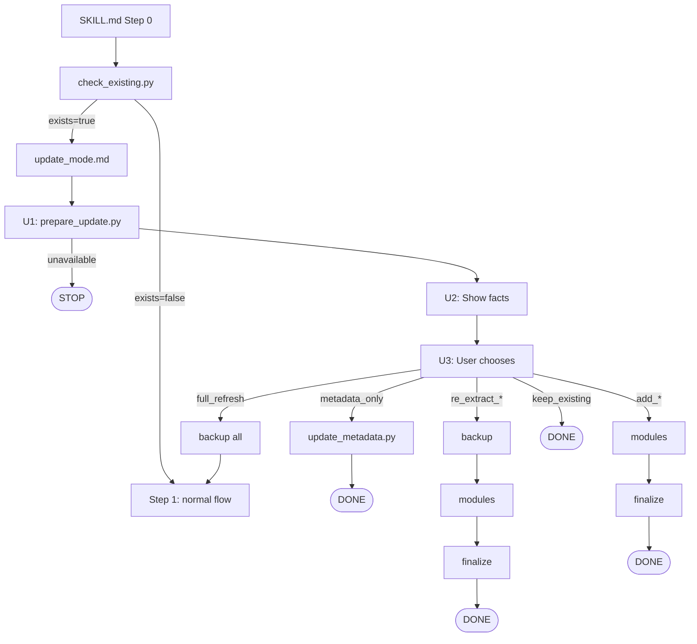

# DONE: Update Mode Redesign

## Intent

When user runs skill on already-extracted video, show current state and let them choose what to update.

## Acceptance Criteria

- [ ] check_existing.py returns only: exists, video_id, file paths
- [ ] prepare_update.py handles all analysis (version, validity, metadata diff)
- [ ] User can update metadata, re-extract components, or add missing parts
- [ ] Backups created before any replacement
- [ ] Unit tests pass
- [ ] Integration tests pass (manual)

## Constraints

- prepare_update.py is read-only (no file writes)
- Don't modify module logic other than update_mode.md
- Reuse extract_data.py for API access

## Context

### Current State (to be refactored)

check_existing.py currently does too much:
- `detect_v1_summary()`, `detect_v1_comments()` → move to prepare_update.py
- `validate_*_integrity()` → move to prepare_update.py
- `extract_metadata_from_file()` → move to prepare_update.py

### Target Architecture

**check_existing.py (minimal):**
```python
def check_existing(video_url: str, output_dir: Path) -> dict:
    """Returns only: video_id, exists, summary_file, transcript_file, comment_file"""
```

**prepare_update.py (all analysis):**
- Import detection/validation functions from check_existing.py OR move them here
- Fetch fresh metadata via `YouTubeDataExtractor.fetch_video_data()`
- Compare stored vs current metadata
- Detect transcript state (raw vs polished)

### Version Detection Logic

**Summary v1:** Contains `**What**:`, `**Why**:`, `**How**:` without type markers
**Summary v2:** Has type-specific markers (`### Prerequisites`, `**Result**:`, `- **[`)
**Comments v1:** Missing sections like `**Common Failures**`, `**Success Patterns**`
**Comments v2:** Has type-specific sections
**Transcript raw:** No `## ` headings
**Transcript polished:** Has `## ` headings

### Metadata Format in Summary

```markdown
- **Engagement:** 2.2M views · 71.2K likes · 2.2K comments
- **Published:** 2024-01-15 | Extracted: 2024-03-20
```

### API Access Pattern

```python
from extract_data import YouTubeDataExtractor
extractor = YouTubeDataExtractor()
raw_data = extractor.fetch_video_data(video_url, output_dir)  # dict, no file writes
# Returns: title, view_count, like_count, comment_count, chapters, language, etc.
```

### Existing Utilities

| File | Function | Use |
|------|----------|-----|
| `file_ops.py` | `backup(path)` | Creates `{stem}_backup_{YYYYMMDD}{suffix}` |
| `file_ops.py` | `cleanup(dir, video_id)` | Removes intermediate files |
| `finalize.py` | flags | `--summary-only`, `--transcript-only`, `--comments-only`|

## Core Principle

**Show facts → User decides → Backup → Run modules → Finalize**

No complex "if X then offer Y" logic. User sees state, picks action.

## Detectable States

| State | How detected | Shown to user |
|-------|--------------|---------------|
| Files exist | check_existing.py | "Found existing files" |
| Invalid/broken | prepare_update.py | "Summary: invalid (empty content)" |
| Intermediate files | prepare_update.py | "Incomplete extraction detected" |
| Summary format | prepare_update.py | "Summary: v1 (outdated)" or "v2" |
| Comments format | prepare_update.py | "Comments: v1 (outdated)" or "v2" |
| Transcript format | prepare_update.py | "Transcript: raw" or "polished" |
| Metadata changed | prepare_update.py | Views: 1000→1500, Likes: 100→150 |
| Content changed | prepare_update.py | "Title changed", "Description changed" |
| Video language | prepare_update.py | "Language: en" |
| Video unavailable | prepare_update.py | "Video no longer available" |

### Transcript states

| State | Description | User options |
|-------|-------------|--------------|
| missing | No transcript file | "Add transcript" |
| raw | Unformatted text (deduped VTT) | "Polish transcript", "Re-extract transcript" |
| polished | Paragraphs, headings, cleaned | "Re-extract transcript" |

## User Actions

After seeing facts, user can choose:
- **Update metadata only** - just numbers, no re-extraction
- **Re-extract [component/s]** - backup old, run modules for that component
- **Add [missing component/s]** - run modules for missing part
- **Polish transcript** - if raw transcript exists, run only transcript_polish.md
- **Full refresh** - backup all, start fresh (→ SKILL.md Step 1)
- **Keep existing** - do nothing

## Architecture



## prepare_update.py

**Read-only analysis** - fetches current state from API, compares with stored, outputs facts. No files written.

### Input
```bash
python3 ./prepare_update.py "<YOUTUBE_URL>" "<output_directory>"
```

### Output JSON
```json
{
  "video_id": "abc123",
  "video_available": true,
  "base_name": "youtube_abc123",
  "language": "en",

  "existing": {
    "summary": {"exists": true, "valid": true, "version": "v2", "path": "..."},
    "transcript": {"exists": true, "valid": true, "version": "raw|polished", "path": "..."},
    "comments": {"exists": true, "valid": true, "version": "v1", "path": "..."}
  },

  "intermediate_files": ["youtube_abc123_metadata.md", "youtube_abc123_transcript.vtt"],

  "metadata": {
    "stored": {"views": 1000, "likes": 100, "comment_count": 10, "title": "Old Title", "chapters": 0},
    "current": {"views": 1500, "likes": 150, "comment_count": 50, "title": "New Title", "chapters": 5}
  }
}
```

No `issues` array - update_mode.md shows raw facts, user interprets.

## update_mode.md proposal

### Structure

```markdown
# Update Mode

## Step U1: Analyze

python3 ./prepare_update.py "<YOUTUBE_URL>" "<output_directory>"

If video_available=false: Inform user "Video no longer available", STOP.

## Step U2: Show facts

Display table from prepare_update.py output:

| Component | Status | Version | Path |
|-----------|--------|---------|------|
| Summary | ✓ exists | v2 | path/to/summary.md |
| Transcript | ✗ missing | - | - |
| Comments | ✓ exists | v1 (outdated) | path/to/comments.md |

| Metadata | Stored | Current |
|----------|--------|---------|
| Views | 1000 | 1500 |
| Title | "Old" | "New" |
| Language | - | en |

If intermediate_files not empty: "Incomplete extraction detected: [files]"

## Step U3: Ask user

AskUserQuestion with multiSelect=false:
- "Update metadata only" (only if metadata changed, files valid)
- "Re-extract summary" (only if summary exists)
- "Re-extract transcript" (only if transcript exists)
- "Polish transcript" (only if transcript is raw, not polished)
- "Re-extract comments" (only if comments exist)
- "Add transcript" (only if transcript missing)
- "Add comments" (only if comments missing)
- "Full refresh"
- "Keep existing"

Show only relevant options based on state.

## Step U4: Execute

### metadata_only
python3 ./update_metadata.py "<summary_path>" "<output_directory>/${BASE_NAME}_metadata.md"
DONE

### re_extract_summary
python3 ./file_ops.py backup "<summary_path>"
Run: transcript_extract.md → transcript_summarize.md
python3 finalize.py --summary-only "${BASE_NAME}" "<output_directory>"
DONE

### re_extract_transcript
python3 ./file_ops.py backup "<transcript_path>"
Run: transcript_extract.md → transcript_polish.md
python3 finalize.py --transcript-only "${BASE_NAME}" "<output_directory>"
DONE

### re_extract_comments
python3 ./file_ops.py backup "<comments_path>"
Run: comment_extract.md → comment_summarize.md
(comment_summarize replaces "## Comment Insights" section in summary)
python3 finalize.py --comments-only "${BASE_NAME}" "<output_directory>"
DONE

### add_transcript
Run: transcript_extract.md → transcript_polish.md
python3 finalize.py --transcript-only "${BASE_NAME}" "<output_directory>"
DONE

### polish_transcript
(Only if raw transcript exists - skip extraction, just polish)
Run: transcript_polish.md
python3 finalize.py --transcript-only "${BASE_NAME}" "<output_directory>"
DONE

### add_comments
Run: comment_extract.md → comment_summarize.md
python3 finalize.py --comments-only "${BASE_NAME}" "<output_directory>"
DONE

### full_refresh
python3 ./file_ops.py backup "<summary_path>"
python3 ./file_ops.py backup "<transcript_path>"
python3 ./file_ops.py backup "<comments_path>"
Return to SKILL.md Step 1

### keep_existing
python3 ./file_ops.py cleanup "<output_directory>" "${VIDEO_ID}"
DONE
```

## SKILL.md Changes proposal

### New Step 0
```markdown
## Step 0: Check if extracted before

python3 ./check_existing.py "<YOUTUBE_URL>" "<output_directory>"

If exists=false: Continue to Step 1.

If exists=true: Read and follow ./modules/update_mode.md
```

Simplified - all update logic moves to update_mode.md.

## Files to Change

| File | Action |
|------|--------|
| `check_existing.py` | SIMPLIFY: remove `detect_v1_*`, `validate_*`, `extract_metadata_*` - keep only file finding |
| `prepare_update.py` | NEW: move analysis functions here + add metadata diff + transcript state |
| `update_metadata.py` | NEW: replace metadata section in summary |
| `modules/update_mode.md` | REWRITE: U1-U4 flow |
| `SKILL.md` | Simplify Step 0 |

## Implementation Order

1. Create prepare_update.py (copy analysis functions from check_existing.py, add new logic)
2. Create update_metadata.py
3. Simplify check_existing.py (remove copied functions)
4. Rewrite modules/update_mode.md
5. Simplify SKILL.md Step 0
6. Update tests (move check_existing tests to prepare_update)
7. Manual integration tests

## Verification proposal

```bash
# Unit tests
cd tests && uv run pytest youtube-to-markdown/test_prepare_update.py
cd tests && uv run pytest youtube-to-markdown/test_update_metadata.py
```

### Integration tests (manual)

The skill is project installed with symlink. Test with "claude -p".

| Case | Setup | Action | Expected |
|------|-------|--------|----------|
| 1 | Extract video, manually edit summary to v1 markers | Run update | Shows "v1 (outdated)", user picks "Re-extract summary" |
| 2 | Extract video, wait for views to change | Run update | Shows metadata diff, user picks "Update metadata only" |
| 3 | Extract video, corrupt summary file | Run update | Shows "invalid", user picks "Re-extract summary" |
| 4 | Extract summary only | Run update | Shows transcript missing, user picks "Add transcript" |
| 5 | Extract with few comments, wait | Run update | Shows comment count increase, user picks "Re-extract comments" |
| 6 | Any existing extraction | Run update, user picks "Full refresh" | Backs up all, returns to Step 1 |
| 7 | Extract video, title/description changed | Run update | Shows content change, offers refresh |
| 8 | Extract with English transcript | Run update, user picks "Re-extract transcript" | Backs up, re-extracts |
| 9 | Use deleted/private video URL | Run update | Shows "Video no longer available", STOP |
| 10 | Kill extraction mid-process | Run update | Shows "Incomplete extraction detected", user picks action |

## Design Decisions

1. **check_existing.py vs prepare_update.py**: Keep separate, different responsibilities:
   - `check_existing.py`: Minimal, "do files exist with this video_id?" → exists, paths
   - `prepare_update.py`: All analysis (valid, version, metadata diff, API fetch)
   - Flow: SKILL.md → check_existing → if exists → update_mode.md → prepare_update

2. **prepare_update.py is read-only**: No files written. Just fetches API data, compares in memory, outputs JSON. Modules write files when executed.

3. **User decides**: No complex conditional logic. Show facts, user picks action from relevant options.

4. **Comment insights in summary**: When re-extracting comments:
   - comment_summarize.md finds and replaces `## Comment Insights` section
   - Must handle both "section exists" and "section missing" cases

5. **extract_data.py duplication**: prepare_update.py fetches metadata via API for comparison only (no file write). When modules run, transcript_extract.md calls extract_data.py which writes files. No duplication since prepare_update doesn't persist.

## Out of Scope

**Raw transcript preservation**: Currently raw transcript is deleted during cleanup. "Polish transcript" action would need raw to exist. Separate task - not blocking this work.

## Risks

- Metadata parsing from summary may be fragile → use clear markers
- Video availability check may be slow → timeout handling
- Comment insights section replacement must be robust → clear section markers

---

## Implementation Notes (2026-01-26)

### What Changed from Plan

1. **check_existing.py NOT simplified** - kept analysis functions there, added title extraction instead
   - Reason: Functions were already well-tested, moving would require significant test refactoring
   - prepare_update.py imports from check_existing.py instead of duplicating

2. **prepare_update.py generates recommendations** - added `recommendation` field with action, reason, suggested_output
   - Plan said "no issues array, user interprets" but explicit recommendations improve UX
   - User still decides, recommendation is just a suggestion

3. **update_mode.md → update_flow.md** - renamed for clarity
   - "flow" better describes the sequential steps than "mode"

4. **intermediate_files.py created** - extracted work file patterns to shared module
   - Found duplication between finalize.py and file_ops.py during skeptic review
   - Single source of truth prevents future drift

5. **Backup timestamp changed** - YYYYMMDD → YYYYMMDD_HHMMSS
   - Found during testing: same-day runs overwrote previous backups
   - Seconds precision prevents data loss

6. **Title extraction added to check_existing.py**
   - Plan assumed title comparison not possible
   - Found title is stored in summary: `**Title:** [Title Text](url)`
   - Enables accurate "content changed" detection

### What Was Learned

1. **Plan skeptic review is valuable** - found 4 bugs/issues before commit:
   - Intermediate file duplication
   - Backup overwrite bug
   - Missing title comparison
   - Update logic bloating SKILL.md

2. **"B" suffix for billions** - parse_count() only handled K/M, not B
   - Real YouTube videos have billions of views (Rick Astley: 1.7B)
   - Always test with real data, not just synthetic

3. **yt-dlp error messages go to stderr** - can't easily detect "unavailable" from Python
   - Solution: treat any FileOperationError as potentially unavailable
   - Acceptable tradeoff: false positives rare, user sees clear message

4. **Regex section replacement is tricky** - extra blank lines, newline handling
   - Multiple iterations needed to get formatting right
   - Unit tests essential for catching edge cases

5. **SKILL.md context bloat** - 40 lines of update logic loaded even when not needed
   - Solution: move to loadable module, SKILL.md just says "read update_flow.md"
   - Pattern: keep main skill file minimal, load modules on demand

### Acceptance Criteria Status

- [x] check_existing.py returns: exists, video_id, file paths (+ kept analysis for reuse)
- [x] prepare_update.py handles all analysis (version, validity, metadata diff)
- [x] User can update metadata, re-extract components, or add missing parts
- [x] Backups created before any replacement (with unique timestamps)
- [x] Unit tests pass (189 tests)
- [x] Integration tests pass (Cases 3, 4, 5, 9 manually verified)

---

## Additional Fixes (2026-01-29)

### Intent

User sees stored vs current metadata and can re-extract individual components without full refresh.

### Goal

1. Display metadata comparison table in Step U2
2. Offer "Re-extract comments" and "Re-extract transcript" as separate options in Step U3

### Acceptance Criteria

- [ ] Step U2 shows table: Views/Likes/Comments with Stored vs Current columns
- [ ] Step U3 offers "Re-extract comments" when comments exist
- [ ] Step U3 offers "Re-extract transcript" when transcript exists
- [ ] Re-extract comments flow: backup → comment_extract.md → comment_summarize.md → 50_assemble.py
- [ ] Re-extract transcript flow: backup → transcript_extract.md → transcript_polish.md → 50_assemble.py
- [ ] Manual test: verify both re-extract options work

### Constraints

- Only modify `subskills/update_flow.md`
- Do not modify prepare_update.py (already returns needed data)
- Do not modify Python scripts

### Context

**prepare_update.py output structure (relevant fields):**
```json
{
  "stored_metadata": {"views": "1.2M", "likes": "50K", "comments": "500"},
  "current_metadata": {"views": "1.5M", "likes": "60K", "comments": "1.2K"},
  "changes": {
    "views": {"changed": true, "significant": false},
    "comment_count": {"changed": true, "significant": true}
  },
  "existing_files": {
    "summary": "/path/to/summary.md",
    "comments": "/path/to/comments.md"
  },
  "action": "update_comments",
  "reason": "Significant new comments",
  "files_to_backup": ["/path/to/comments.md"]
}
```

**Scripts:**
- `./scripts/40_backup.py backup <file>` - creates timestamped backup
- `./scripts/50_assemble.py --comments-only ${BASE_NAME} <output_dir>` - finalizes comments

**Subskills:**
- `./subskills/comment_extract.md` - fetches comments from YouTube
- `./subskills/comment_summarize.md` - generates comment insights

### Changes to update_flow.md

**Step U2 - add after component table:**
```markdown
If stored_metadata and current_metadata differ, show:

| Metric | Stored | Current |
|--------|--------|---------|
| Views | {stored_metadata.views} | {current_metadata.views} |
| Likes | {stored_metadata.likes} | {current_metadata.likes} |
| Comments | {stored_metadata.comments} | {current_metadata.comments} |

Omit rows where values are identical.
```

**Step U3 - replace options:**
```markdown
- "Update metadata only" (if action=metadata_only)
- "Re-extract comments" (if existing_files.comments exists) ← most common use case
- "Re-extract transcript" (if existing_files.transcript exists)
- "Add comments" (if existing_files.comments missing, existing_files.summary exists)
- "Full refresh" (always)
- "Keep existing" (always)

Note: When all files are valid, "Re-extract comments" is typically what user wants
(videos accumulate comments over time). Show it first among re-extract options.
```

**Step U4 - add execution paths:**
```markdown
**If "Re-extract comments":**
python3 ./scripts/40_backup.py backup "<existing_files.comments>"
Run: comment_extract.md → comment_summarize.md
python3 ./scripts/50_assemble.py --comments-only "${BASE_NAME}" "<output_directory>"
DONE

**If "Re-extract transcript":**
python3 ./scripts/40_backup.py backup "<existing_files.transcript>"
Run: transcript_extract.md → transcript_polish.md
python3 ./scripts/50_assemble.py --transcript-only "${BASE_NAME}" "<output_directory>"
DONE
```

### Validation

```bash
# Manual test with claude -p
# 1. Extract video with few comments
# 2. Wait for more comments (or use video known to have grown)
# 3. Run skill again, verify:
#    - Metadata table shows comment count difference
#    - "Re-extract comments" option appears
#    - Selecting it backs up old, extracts new, assembles
```

### Out of Scope

- **Re-extract summary**: Requires transcript extraction → cleaning → summarizing → tightening. Effectively a full reload, use "Full refresh" instead.
